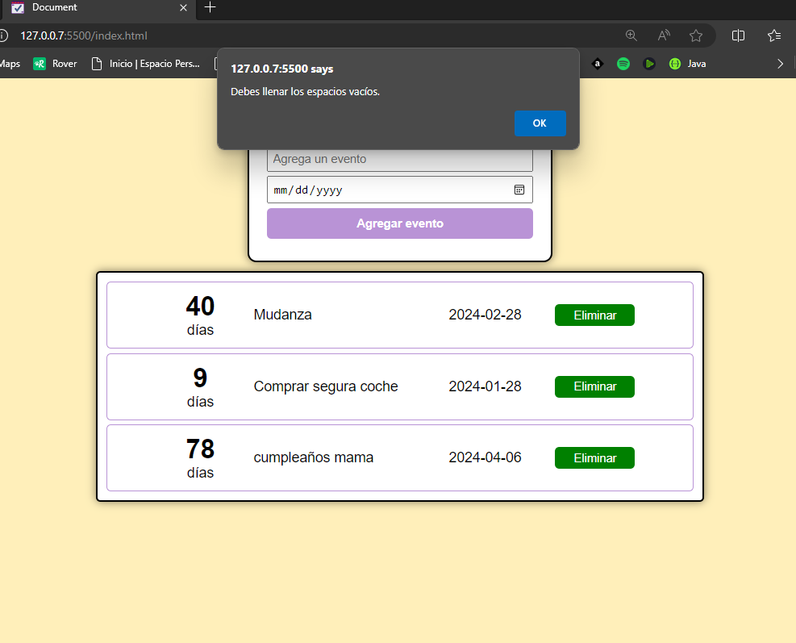

**📅 Eventos del Calendario 📆**

✨<a href="https://luiso-o.github.io/Calendario-de-Tareas/" target="_blank">Link para ver el proyecto con GitHub Pages 😊🔗</a>✨

Este proyecto es una aplicación simple para gestionar eventos y recordatorios. Puedes agregar eventos importantes, ver cuántos días faltan para cada uno y eliminar aquellos que ya han pasado. ¡Nunca más olvides una fecha especial! 🎉

**Funcionalidades:**
- ✨ Agregar eventos con nombre y fecha.
- 📆 Visualizar cuántos días faltan para cada evento.
- ❌ Eliminar eventos pasados.
- 📥 Almacenamiento en el navegador para conservar tus eventos.

¡Organiza tu vida con Eventos del Calendario y nunca pierdas de vista las fechas importantes! 🚀

